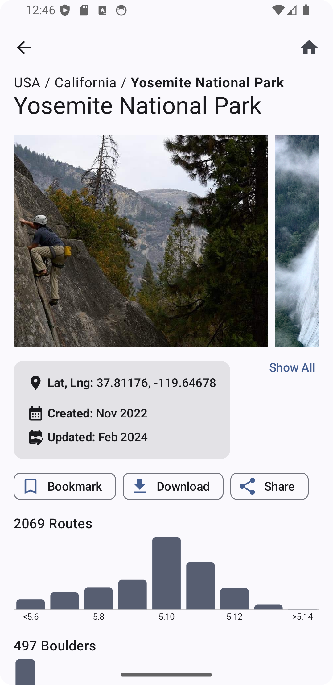
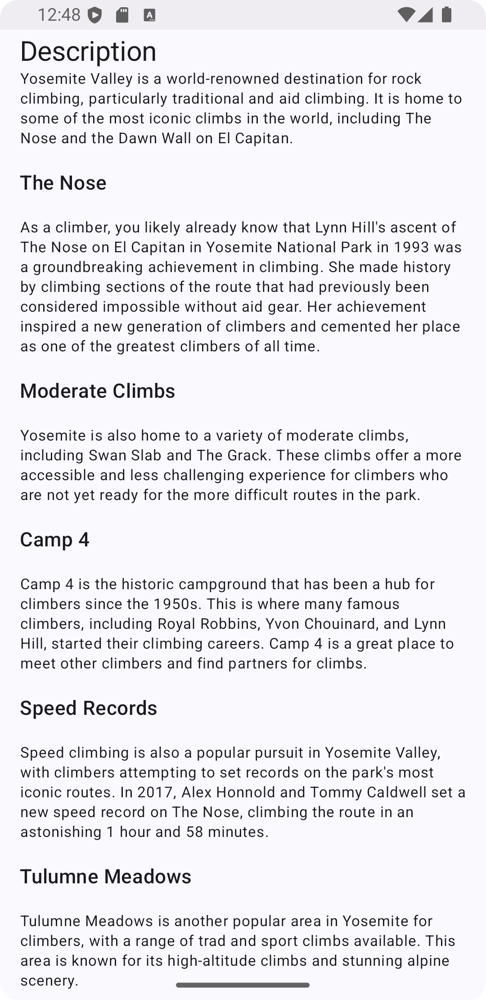
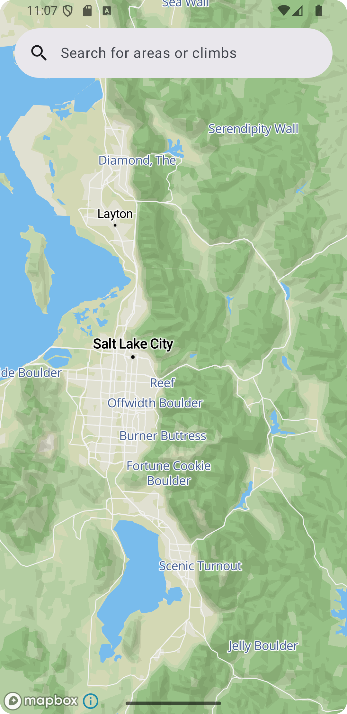
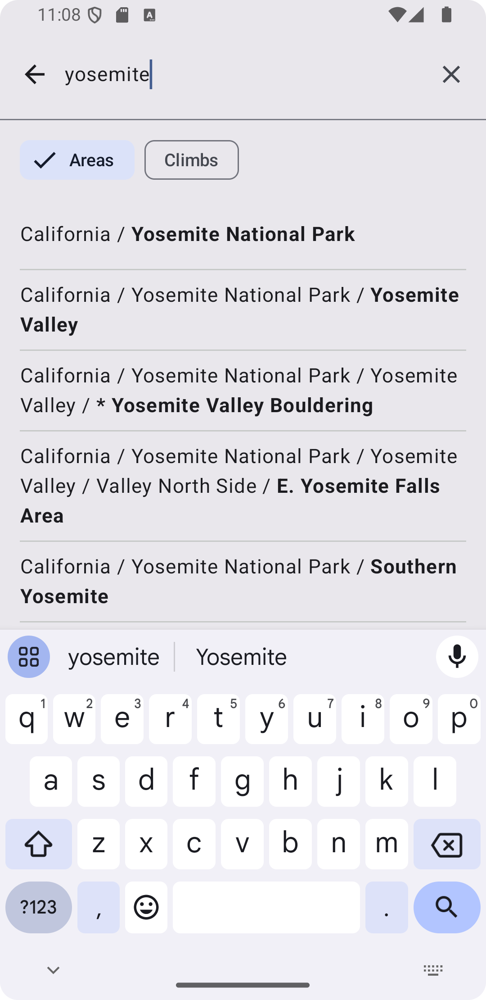

# Route Search

Rock climbing app in progress. Nearby climbs can be found using an interactive map or 
users can search for climbs. Descriptions, types, grades, images, and more are all available for areas and individual 
climbs.

Based on the open source OpenBeta GraphQl API. App structured with an MVVM architecture. Notable libraries implemented 
include Room, Coil, Koin, Mapbox, and Apollo.

## Screenshots

  
    
  
  
  

## Attribution
<a href="https://openbeta.io/" title="openbeta">Check out Openbeta here</a>  
